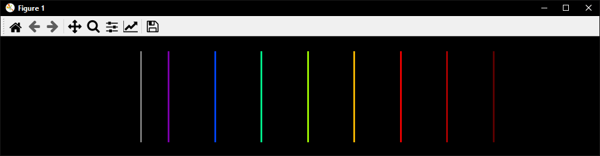

# Spectrum Generator

This project is a Python-based spectrum generator that creates an image of a spectrum on a black or white background. It displays visible wavelengths in their corresponding colors and non-visible wavelengths in gray.

## Requirements

The following libraries are required to run the project:

- `numpy`
- `matplotlib`

## Usage

1. Clone the repository or copy the project code to your local machine.
2. Run the Python script, specifying the desired wavelengths.

Code

```python
wavelengths = [300, 350, 400, 450, 500, 550, 600, 650, 700, 800]
generate_spectrum(wavelengths)
```

generate specrum like




